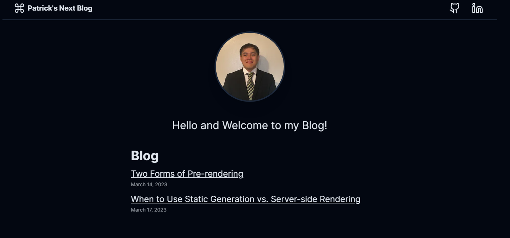

<div id="top"></div>

<!-- PROJECT SHIELDS -->

[![MIT License][license-shield]][license-url]

<!-- PROJECT LOGO -->
<br />
<p align="center">
  <a href="https://next-blog-pattycoding123.vercel.app/">
    
  </a>
</p>
<div align="center">
  
<h1 align="center">My Next Blog</h1>

  <p align="center">
    A blog website that utilizes many of the new features in Next13, including the now stable app directory! The main feature includes compiling MDX files to display on the website. I will try to create as many posts as I can for this website. 
    <br />
    <br />
    <a href="https://next-blog-pattycoding123.vercel.app/">Live Website</a>
  </p>
</div>

<!-- TABLE OF CONTENTS -->
<details>
  <summary>Table of Contents</summary>
  <ol>
    <li>
      <a href="#about-the-project">About The Project</a>
      <ul>
        <li><a href="#features">Features</a></li>
      </ul>
    </li>
    <li><a href="#installation">Installation</a></li>
    <li><a href="#roadmap">Roadmap</a></li>
    <li><a href="#license">License</a></li>
    <li><a href="#authors">Authors</a></li>
  </ol>
</details>

<!-- ABOUT THE PROJECT -->

## About The Project

The project is a fullstack web application that will display blog posts from a remote location. I utilize the GitHub API to fetch the blog posts from one of my repos. The files for these posts are in MDX files, a superset of MD which allows the use of
JSX elements right along side markdown syntax. Coupled with the new yet stable NextJS app directory, this website is making use of all the bleeding-edge tech!
<br><br>

For the technology stack, the project was bootstrapped with `create-t3-app`, but I use the app directory. The use of the
create-t3-app was to easily create the best starting point for a type-safe NextJS application.

<p align="right">(<a href="#top">back to top</a>)</p>

## Features

- New `/app` dir
- Routing, layouts
- Data fetching, caching
- Metadata
- Server and client components
- **MDX** for blog posts
- Styled with **Tailwind CSS**
- Data validations with **Zod**
- Written in **TypeScript**

<p align="right">(<a href="#top">back to top</a>)</p>

<!-- Installation -->

## Installation

1. Clone the repo

```sh
$ git clone https://github.com/PattyCoding123/next-blog.git
```

<br><br> 2. In the root directory, install the needed dependencies with [npm](https://www.npmjs.com/):

```sh
$ npm install --save npm-install-global
```

with yarn

```sh
$ yarn
```

with pnpm

```sh
$ pnpm install
```

<!-- ROADMAP -->

## Roadmap

- [x] Add MDX support
- [x] Responsive styles
- [x] Dark mode
- [ ] Utilize Suspense and Error Boundaries

<!-- LICENSE -->

## License

Distributed under the MIT License. See `LICENSE.md` for more information.

<p align="right">(<a href="#top">back to top</a>)</p>

<!-- Authors -->

## Authors

- Patrick Ducusin

<p align="right">(<a href="#top">back to top</a>)</p>

<!-- MARKDOWN LINKS & IMAGES -->

[license-shield]: https://img.shields.io/github/license/PattyCoding123/next-blog?color=%23808080&style=for-the-badge
[license-url]: https://github.com/PattyCoding123/next-blog/blob/main/LICENSE.md
